# Acme Widget Co Sales System

This project is an implementation of a basket system for Acme Widget Co Sales System, providing features for product catalogs, delivery charge rules and special offers.

The project's goal is to be easy, performant, extensible, and platform agnostic while meeting the criteria specified in the test. There is a large focus on code quality and readability. The code is heavily documented and contains examples that make it easier for new developers to understand and extend the codebase. Examples are included in the README and the tests which cover 100% of the codebase.

## Assumptions

For this basket to be re-used across multiple environments, models have been provided which describe the data format of products, delivery charge rules, offers, conditions for offers, and price adjustments for offers.

No matter the datasource for any of the models listed above, the basket should be able to handle the data and provide the expected results. Using a database could replace some data structures within the basket.

For the purpose of this test, the models are used to describe the data format. **An example database schema is included in the Entity Relation Diagram section.**

\*\*Delivery costs are calculated after discounts are applied

## Design

All financial information provided to the basket is converted to a string and uses the ext-bcmath extension to handle precision. Many helper methods are provided to help maintain this precision when doing common calculations with the basket.

## Installation & Testing

**PHP 8.1.10**

**Clone this repository**

```bash
git clone https://github.com/MrWebMD/AcmeBasket
```

**Install dependencies**

```bash
cd AcmeBasket
composer install
```

**Run tests (100% Test coverage)**

```
composer test

PHPUnit 10.5.14 by Sebastian Bergmann and contributors.

Runtime:       PHP 8.1.10
Configuration: ... phpunit.xml

.....................                                             21 / 21 (100%)

Time: 00:00.021, Memory: 8.00 MB

OK (21 tests, 41 assertions)

```

## Basic usage

```php
use Acme\Basket\Basket;

$basket = new Basket(
    // will be defined later
    $productCatalog,
    $deliveryChargeRules,
    $productOffers
);

$basket->add("B01");

$basket->getDeliveryCost(50); // 4.95

$basket->getTotal() // 12.9

```

## Product Catalog `$productCatalog`

All products the basket handles are initialized using the `CatalogProduct` class. This class makes it easy to define products with a sku, name and price that are consistent with the internal logic of the `Basket` class.

```php

use Acme\Basket\CatalogProduct;

// SKU, Name, Price
new CatalogProduct('R01', 'Red Widget', 32.95)
```

The basket must be initialized with a list of `CatalogProduct` where the key is the SKU and the value is the `CatalogProduct` instance. The advantage of have the SKU as the key is to make matching products with their offers extremely fast with O(1) time complexity without a database involved.

```php
use Acme\Basket\CatalogProduct;

$productCatalog = [
    'R01' => new CatalogProduct('R01', 'Red Widget', 32.95),
    'G01' => new CatalogProduct('G01', 'Green Widget', 24.95),
    'B01' => new CatalogProduct('B01', 'Blue Widget', 7.95),
];
```

## Delivery Costs `$deliveryChargeRules`

Delivery costs can change depending upon the total price of the basket. Delivery costs are defined using the `DeliveryChargeRule` class. This class makes it easy to conditionally apply delivery costs based on the total price of the basket.

```php
use Acme\Basket\DeliveryChargeRule;

// minimum price, maximum price, delivery price
$deliveryRule = new DeliveryChargeRule(null, 50, 4.95)
```

The minimum and maximum arguments are nullable, if the minimum is null, the rule will apply to all orders below the maximum price. If the maximum is null, the rule will apply to all orders above the minimum price. If both are null, the rule will apply to all orders.

You can determine if a delivery rule is eligible for a given cart total using the `isEligible` method and you can calculate a new cart total using the `getTotal` method

```php
$deliveryRule->isEligible(60) // false

$deliveryRule->getTotal(30) // $30.00 since the rule doesn't apply

```

Here's how you define a list of delivery charge rules to provide to the basket.

```php
use Acme\Basket\DeliveryChargeRule;

$deliveryChargeRules = [
    new DeliveryChargeRule(null, 50, 4.95),
    new DeliveryChargeRule(50, 90, 2.95),
    new DeliveryChargeRule(90, null, 0.00),
];

```

## Special offers

Special offers are defined using the `ProductOffer` class. This class makes it easy to define offers that apply to a specific product or a group of products.

```php
$offer = new ProductOffer(
  // Offer title
  'Get $10 off when you buy 3 or more',
  // Offer description
  "Limited time offer",
  [
    // Eligible quantity of 3 or more
    new QuantityCondition(3, null)

    // Eligible quantity between 5 and 10
    // new QuantityCondition(5, 10)

    // Same as no condition
    // new QuantityCondition(null, null)
  ],
  [
    // $10 taken off of the price
    new FixedAdjustment("-10.00")
  ]
);
// Multiple products can be assigned the same offer.

$productOffers = [
  "R01" => $offer,
  "G01" => $offer
];

```

## Scaling

The basket is designed to be easily scalable. The `CatalogProduct` class is based on an abstract class called `CatalogProductType` which means you can implement your own product types with their own logic. This includes defining getter and setter methods that interact with a database model.

The speed at which the basket algorithm handles the data you give it is defined as follows:

| Action                      | Time Complexity                          |
| --------------------------- | ---------------------------------------- |
| Adding, removing products   | O(1)                                     |
| Finding product offers      | O(1)                                     |
| Total calculation           | O(n) grows with basket                   |
| Delivery charge calculation | O(n) grows with amount of delivery rules |

The basket's memory complexity is O(n), where the amount of memory the basket consumes is proportional to the amount of products and offers passed to it. When using a database to store products and offers, the memory complexity is O(1) since the basket doesn't store the data, it only queries it.

## Entity Relation Diagram [Explore the Full Chart!](https://mermaid.live/view#pako:eNrNV21T4jAQ_iuZfK4Ob_L2jaF4x6mA0DrjDTOd2ETMSV9MU0cE_vttWopFwunIDdhP3fR5ku6T3c1mjt2AMtzETJicTATxxj6Cxx51hiM0Tw313PEJ9yXiFA0u0BjbPn-KGZjMl_yeMzHGKXY59tOXwbBv2m3rS5Oo55kI94EIFD3GAB3JwH1EF4yF3J8gIEoDpXQdxyceA9JABDR2JeqBmYdR5nKPTFEouJvHDZS9ASSSSQ5zuYLBK3WIBHhbGTzwkQljWngc0jf4JYkkspORDcZaKaW1s69cK2wcMeEA4VwRhuyeCea7LEr3M49X4KeYwExylpPgejWkmTpMIbrZs58_vHb983MQz7oddPYOtGcyjVU0WLOQoRtlHMmdvT2BDZwqT_r3sEPIUpYORlnkCh4m_5-BzbcxTQgECuNIEEgXBbm9OLxy13arZ3WtW6fd75ldq9vv7ZtKqbO7_NxKJo_7Ti6hrrjPvdhbJ5SBevF0Su42tyIhkpcNInn5BPEwog6G3XbHaZm_7JF11elZ_zfRWvRPHEkPoOiYOffeyQPGzbqywrnjkLUcSYZF-kKr2xDd2aYR-Zg1LTvfjqDttz21vl_gfSrmjqCX2bns3nSGUNx_toY_Os7Qvvx6GXrf_Zlsyp-ZmGnavxVSlXYZSHh7q-uWsnfU5owGhX1NW1X1f9EO1myO0GJxchLM33WeTeCHsarREYsy4vrrhxS6i7JZABIKEZK7PIQfjOAMzIir7kfRFouN1k6RXEBPAsFfGUV3Mw0HltJ1AYorWCRhd2Wkp21noiJ5AVXBs4Oz7RX33WlMP8LrVkozcMOvbeBKlh1nsk4hbGCPCY9wChe8JFvGWD4wdRlScErEo1puCTgSy2A0813clCJmBk6DanUlzAZD4v8OgryJm3P8gpu14mmhdFZv1BrlcqlULjUMPMPNYrF2WquWKtV6-axcLVSL9aWBX5MJiqfVcqFaqVULjbNSpV6plQzMKJeBuEqvo8mtdPkXSh6UTA)

The basket when deployed in a production environment would ideally use a database to store products, offers, and delivery charge rules. The following is an example of a database schema that could be used to store the data and significantly enhance the baskets performance. The schema is written in the Mermaid diagram language and directly mirrors the models used in the basket.

```mermaid
erDiagram
    USERS {
        bigint id PK "Unique identifier"
    }

    PRODUCTS {
        bigint id PK "Unique identifier"
        varchar sku "Stock Keeping Unit, Unique"
        varchar name "Product Name"
        decimal price "Product Price"
        datetime created_at "Creation Date"
        datetime updated_at "Last Update Date"
    }

    USER_PRODUCTS {
        bigint id PK "Unique identifier"
        bigint user_id FK "References USERS"
        int quantity "Product Quantity"
        bigint product_id FK "References PRODUCTS"
        datetime created_at "Creation Date"
        datetime updated_at "Last Update Date"
    }

    OFFER_TYPES {
        bigint id PK "Unique identifier"
        varchar value "Type Value"
        datetime created_at "Creation Date"
        datetime updated_at "Last Update Date"
    }

    OFFERS {
        bigint id PK "Unique identifier"
        varchar title "Offer Title"
        varchar description "Offer Description"
        bigint offer_type_id FK "References OFFER_TYPES"
        datetime created_at "Creation Date"
        datetime updated_at "Last Update Date"
    }

    QUANTITY_CONDITIONS {
        bigint id PK "Unique identifier"
        bigint offer_id FK "References OFFERS"
        int min_quantity "Minimum Quantity, Nullable"
        int max_quantity "Maximum Quantity, Nullable"
        datetime created_at "Creation Date"
        datetime updated_at "Last Update Date"
    }

    PRICE_ADJUSTMENT_TYPES {
        bigint id PK "Unique identifier"
        varchar value "Adjustment Type Value"
        datetime created_at "Creation Date"
        datetime updated_at "Last Update Date"
    }

    PRICE_ADJUSTMENTS {
        bigint id PK "Unique identifier"
        bigint offer_id FK "References OFFERS"
        bigint price_adjustment_types_id FK "References PRICE_ADJUSTMENT_TYPES"
        decimal value "Adjustment Value"
        datetime created_at "Creation Date"
        datetime updated_at "Last Update Date"
    }

    OFFER_PRODUCT {
        bigint id PK "Unique identifier"
        bigint offer_id FK "References OFFERS"
        bigint product_id FK "References PRODUCTS"
        datetime created_at "Creation Date"
        datetime updated_at "Last Update Date"
    }

    OFFER_PRICE_ADJUSTMENTS {
        bigint id PK "Unique identifier"
        bigint offer_id FK "References OFFERS"
        bigint price_adjustments_id FK "References PRICE_ADJUSTMENTS"
        datetime created_at "Creation Date"
        datetime updated_at "Last Update Date"
    }

    DELIVERY_CHARGE_RULES {
        bigint id PK "Unique identifier"
        decimal price "Delivery Price"
        decimal min_total "Minimum Total, Nullable"
        decimal max_total "Maximum Total, Nullable"
        datetime created_at "Creation Date"
        datetime updated_at "Last Update Date"
    }

    USERS ||--o{ USER_PRODUCTS : "purchases"
    PRODUCTS ||--o{ USER_PRODUCTS : "purchased"
    PRODUCTS ||--o{ OFFER_PRODUCT : "participates in"
    OFFERS ||--|| OFFER_TYPES : "categorized by"
    OFFERS ||--o{ QUANTITY_CONDITIONS : "restricts"
    OFFERS ||--o{ PRICE_ADJUSTMENTS : "modifies"
    OFFERS ||--o{ OFFER_PRODUCT : "includes"
    OFFERS ||--o{ OFFER_PRICE_ADJUSTMENTS : "adjusted by"
    PRICE_ADJUSTMENTS ||--|| PRICE_ADJUSTMENT_TYPES : "categorized by"
```


